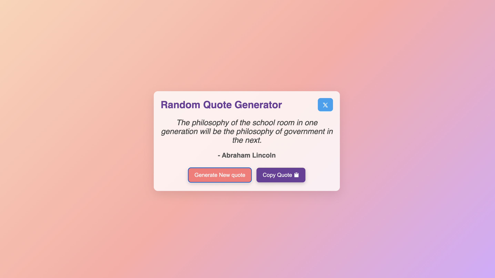

# Random Quote Generator

A simple web app that fetches random quotes from an API, allows users to share them on Twitter, and copy them to the clipboard.

## 🚀 Features
- 📜 Generates random quotes
- 🐦 Share quotes on Twitter
- 📋 Copy quotes to clipboard

## 🛠 Tech Stack
- **HTML**
- **CSS**
- **JavaScript** (Fetch API)

## 🎮 How to Use
1. Click the **"Generate Quote"** button to fetch a new quote.
2. Click the **Twitter icon** to share the quote on twitter.
3. Click the **Copy button** to copy the quote to your clipboard.

## 📷 Preview


## 📌 Setup Instructions
1. Clone the repository:
   ```sh
   git clone https://github.com/ansh0330/Random-Quote-Generator.git
   ```
2. Open the `index.html` file in a browser.
---

## 🔗 Deployment Link 
[Live Link] (https://random-quote-generator-alpha-pied.vercel.app/)


Made with ❤️ by [Ansh](https://github.com/ansh0330)

